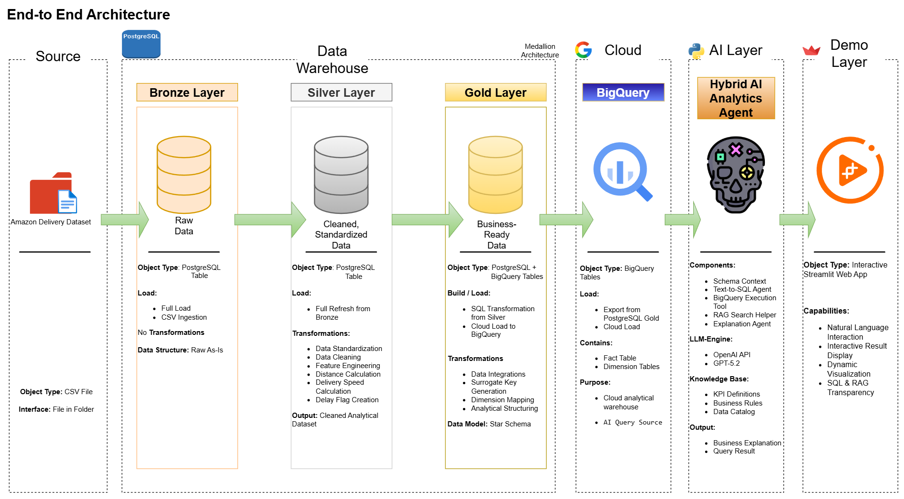
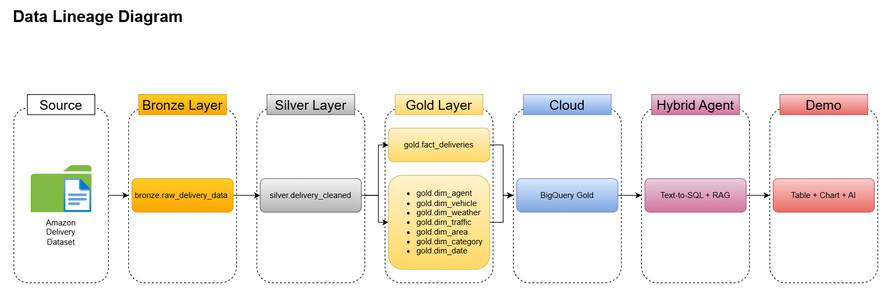
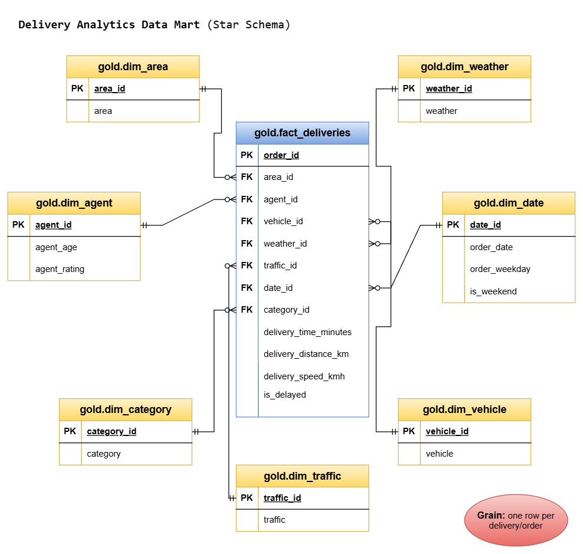
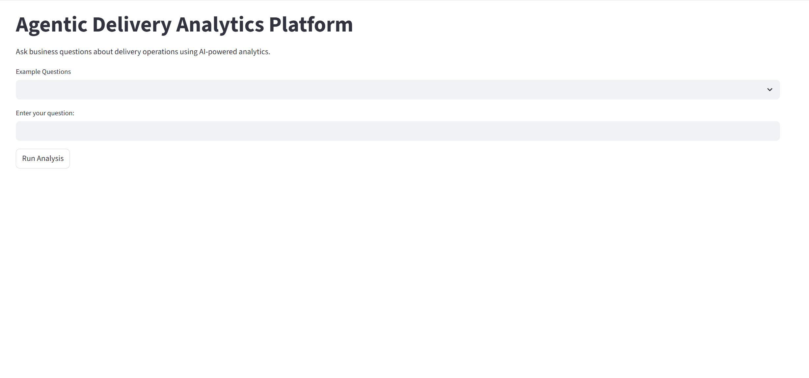

# Agentic Delivery Analytics Platform

AI-powered delivery analytics platform built on a modern medallion data architecture with BigQuery, Text-to-SQL, RAG, and interactive business intelligence workflows.

This project demonstrates how an end-to-end analytical system can transform raw operational delivery data into AI-driven business insights using a hybrid analytics agent architecture.

---

# Project Overview

The platform combines:

- Medallion Architecture (Bronze / Silver / Gold)
- PostgreSQL-based warehouse transformations
- BigQuery cloud analytical layer
- Star schema dimensional modeling
- Hybrid AI Analytics Agent
- Text-to-SQL generation
- RAG-based business context retrieval
- Streamlit interactive demo application
- Dynamic analytical visualizations

The system enables users to ask natural language business questions and receive:

- AI-generated business explanations
- SQL query transparency
- Query results
- Interactive visualizations
- Retrieved business knowledge context

---

# End-to-End Architecture



---

# Data Lineage Flow



---

# Delivery Analytics Star Schema



---

# AI Analytics Demo

## Example Question Flow



---

## User-Generated Question Flow


---

# Core Architecture

## Bronze Layer

Raw ingestion layer storing original delivery dataset without transformations.

### Responsibilities

- Raw CSV ingestion
- Immutable raw storage
- Initial landing zone
- Source preservation

---

## Silver Layer

Cleaned and standardized analytical layer.

### Transformations

- Data cleaning
- Feature engineering
- Distance calculation
- Delivery speed calculation
- Delay flag generation
- Temporal feature extraction

---

## Gold Layer

Business-ready dimensional warehouse modeled using star schema design.

### Fact Table

- `gold.fact_deliveries`

### Dimension Tables

- `gold.dim_agent`
- `gold.dim_vehicle`
- `gold.dim_weather`
- `gold.dim_traffic`
- `gold.dim_area`
- `gold.dim_category`
- `gold.dim_date`

### Warehouse Design

- Surrogate key modeling
- Fact-dimension relationships
- One-to-many dimensional joins
- Analytical query optimization

---

# AI Layer

The AI layer combines Text-to-SQL generation with Retrieval-Augmented Generation (RAG).

## Components

- Schema Context Engine
- SQL Generation Agent
- BigQuery Execution Tool
- RAG Retrieval Pipeline
- Business Explanation Agent
- Knowledge Base Retrieval

## Knowledge Sources

- KPI Definitions
- Data Catalog
- Business Rules
- Analytical Context Documents

---

# Demo Layer

Interactive Streamlit-based analytics interface.

## Features

- Natural language business questions
- AI-generated explanations
- SQL transparency
- Interactive charts
- Dynamic result rendering
- RAG document retrieval display

---

# Technologies Used

## Data Engineering

- Python
- PostgreSQL
- BigQuery
- SQL

## AI / LLM

- OpenAI API
- GPT-5.2
- RAG Architecture
- Text-to-SQL

## Visualization / Frontend

- Streamlit
- Plotly

## Documentation / Modeling

- draw.io
- Markdown

---

# Repository Structure

```text
agentic-delivery-analytics-platform/
│
├── ai_layer/
├── data/
├── docs/
├── exports/
├── sql/
│
├── README.md
└── .gitignore
```

---

# Documentation

Additional documentation is available inside the `docs/` directory.

## Included Documents

- Data Catalog
- Naming Conventions
- Architecture Diagrams
- Data Lineage Flow
- Star Schema Design
- Demo Workflows

---

# Example Business Questions

- Which vehicle has the highest average delivery time?
- What is the delay rate by vehicle?
- Which traffic condition has the highest average delivery time?
- What is the average delivery speed by weather condition?
- Which order hour has the highest number of deliveries?
- Which delivery category has the slowest average delivery speed?

---

# Future Improvements

- Production-grade orchestration pipeline
- Real-time streaming ingestion
- Multi-agent analytical workflows
- Vector database integration
- Semantic caching
- Advanced observability and monitoring
- Automated evaluation pipelines

---

# Author

Built as a portfolio-grade AI Data Engineering and Analytics project focused on combining:

- modern data warehousing,
- cloud analytics,
- AI agents,
- and retrieval-augmented analytical systems.
